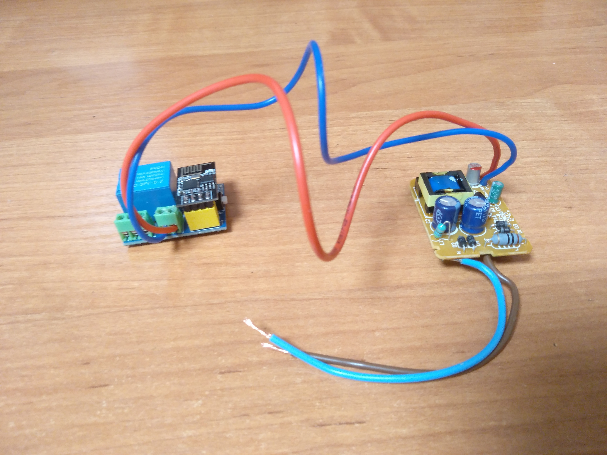

[](https://github.com/serega404/EasyESPRealy/blob/master/LICENSE)


## About The Project

This project was designed to facilitate deployment of a Wi-Fi relay. Advanced users can also extend its functionality with ease.

### Example device


### Installation

1. Open .ino file in Arduino IDE

2. Select COM port and Board in the tools

3. Change the following constants:

    - `WIFI_SSID` - SSID of your Wi-Fi network,
    - `WIFI_PASSWORD` - Wi-Fi password,
    - `MQTT_HOST`, `MQTT_LOGIN`, `MQTT_PASSWORD` - as required to connect to your MQTT Broker.

    It is also recommended to change your `OTAUSER` and `OTAPASSWORD`.

3. Flash the firmware to the ESP.

## Usage

The MQTT Protocol is used in many smart home projects, and this repository is no exception. A server with a MQTT Brocker installed and a client that can handle requests are required.

To enable or disable the relay, send `1` or `0` to `setStateTopic`.
Сurrent status of the relay can be obtained in `stateTopic`.

### Home Assistant template config
```
light:
  - platform: mqtt
    name: "Light 1"
    command_topic: "dvor/light1/state/set"
    state_topic: "dvor/light1/state"
    payload_on: "1"
    payload_off: "0"
    qos: 1
```

## MQTT Topics

* `ipTopic` - returns the IP address after entering boot mode
* `bootTopic` - required for HTTP updater
* `setStateTopic` - necessary to get information from MQTT broker
* `stateTopic` - checks whether the relay is enabled

## OTA Update

1. Send `1` in `bootTopic` to enable firmware update mode
2. Get relay's IP address from `ipTopic` (this can be done with [MQTT-Explorer](https://mqtt-explorer.com/))
3. Go to `http://{ip}/firmware` in your Internet browser
4. Enter your username and password (Default: `admin` / `admin`)
5. Select the file and click *Update Firmware*

## Libraries

* [ESP8266WiFi](https://github.com/esp8266/Arduino/tree/master/libraries/ESP8266WiFi)
* [AsyncMqttClient](https://github.com/marvinroger/async-mqtt-client)
* [ESP8266HTTPUpdateServer](https://github.com/esp8266/Arduino/tree/master/libraries/ESP8266HTTPUpdateServer)
* [Ticker](https://github.com/esp8266/Arduino/tree/master/libraries/Ticker)

## Contributing

Contributions are what make the open source community such an amazing place to be learn, inspire, and create. Feel free to contribute to this project.

## License

Distributed under the MIT License. See `LICENSE` for more information.

## Contact

*Sergey Karmanov* - [@serega404](https://t.me/serega404)